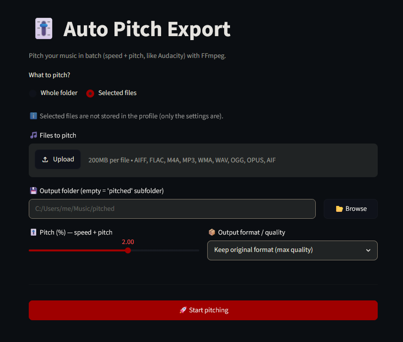

# 🎚️ Auto Pitch Export

Batch-pitch your music (**speed + pitch**, like Audacity's "Change Speed") using FFmpeg.
Simple web interface via Streamlit, or run it from the command line.



---

## ✨ Features

- 🎚️ **Batch pitching** of a whole folder or a selection of files
- 📦 **Format / quality conversion**: MP3 (320, 256, V0…), WAV 16/24-bit, FLAC, AAC, OGG, Opus, or keep the original format at max quality
- 💾 **Saved configuration profiles** (JSON database): create, load, delete your presets
- 🌐 **Multilingual interface** (English by default, French)
- 🔁 Automatic restore of the last state (draft) after a page refresh
- 🖥️ Native folder picker (OS dialog)

> Pitching works by replaying the audio at a modified sample rate (`asetrate`),
> then resampling back to the standard rate (`aresample`) — speed **and** pitch change together.

---

## 📋 Requirements

- **Python 3.8+**
- **FFmpeg** (with both `ffmpeg` **and** `ffprobe` available in PATH)
  - Windows: `winget install ffmpeg` (or [ffmpeg.org/download](https://ffmpeg.org/download.html))
  - macOS: `brew install ffmpeg`
  - Linux: `sudo apt install ffmpeg`

---

## 🚀 Usage

### Graphical interface (recommended)

**Windows** — just double-click:

```
start-app.bat
```

The script checks Python, installs Streamlit if needed, then opens the app in your browser.

**Manually** (any OS):

```bash
pip install streamlit
streamlit run pitch_app.py
```

### Command line

To pitch a whole folder without the interface:

```bash
python auto_pitch_export.py "C:/path/input_folder" "C:/path/output_folder" --rate 1.02
```

| Option       | Description                                            | Default          |
|--------------|-------------------------------------------------------|------------------|
| `input_dir`  | Folder with the original music                        | —                |
| `output_dir` | Folder where pitched files are exported               | —                |
| `--rate`     | Pitch factor (`1.02` = +2%)                           | `1.02`           |
| `--ext`      | Force the output format (`mp3`, `wav`, `flac`…)       | original format  |

---

## 📁 Project structure

| File                   | Role                                                |
|------------------------|-----------------------------------------------------|
| `pitch_app.py`         | Streamlit web app (full interface)                  |
| `auto_pitch_export.py` | Command-line script (pitch a folder)                |
| `start-app.bat`        | Windows launcher (checks Python + Streamlit)        |
| `en.json` / `fr.json`  | Interface translation files                         |
| `profiles.json`        | Saved profiles (generated, git-ignored)             |
| `screen.png`           | Screenshot of the app                               |

---

## 🎵 Supported input audio formats

`.wav` · `.mp3` · `.flac` · `.aiff` · `.aif` · `.m4a` · `.ogg` · `.wma` · `.opus`
